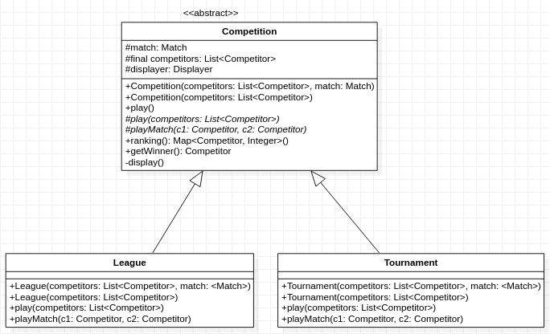
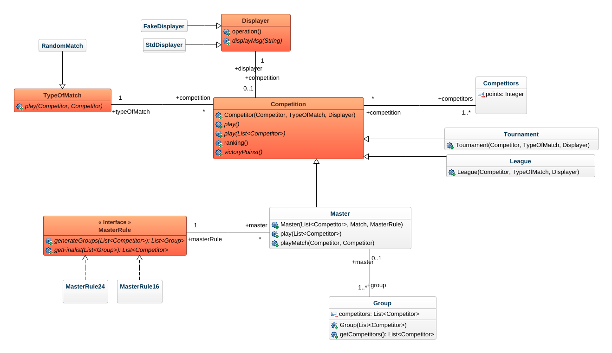
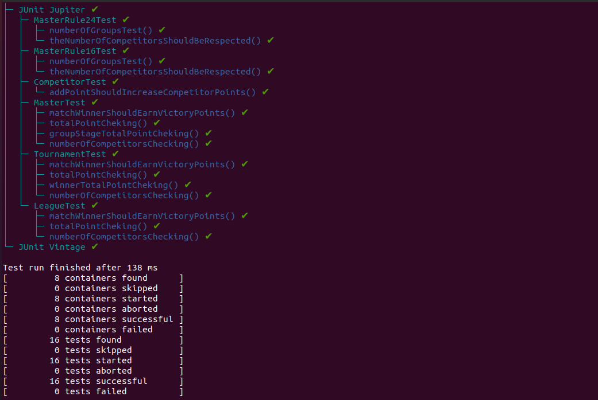
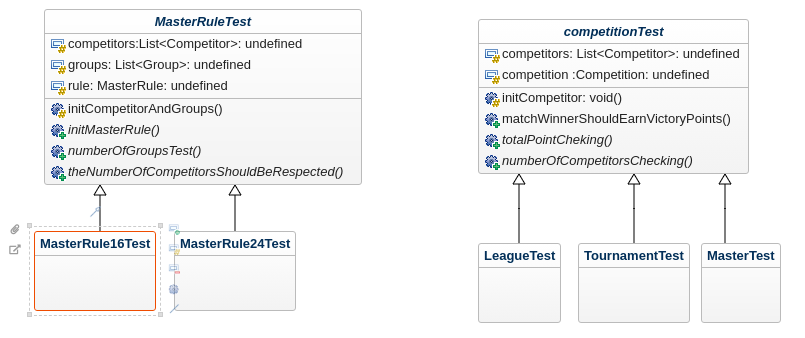
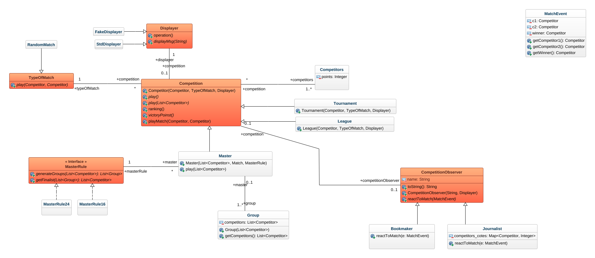

# Progress
## First version


  - [x] Design
  - [X] Tests
  - [X] Code


## Second version


  - [x] design
  - [x] Tests
    

  - [X] Code

## TESTS



## Third Version (Journalist and Bookmaker)
- [x] design



- [x] Implementation
  
- [x] Tests

```bash
Thanks for using JUnit! Support its development at https://junit.org/sponsoring
╷
├─ JUnit Jupiter ✔
│  ├─ MasterRule24Test ✔
│  │  ├─ numberOfGroupsTest() ✔
│  │  └─ theNumberOfCompetitorsShouldBeRespected() ✔
│  ├─ BookMakerTest ✔
│  │  └─ updateCotesTests() ✔
│  ├─ MasterRule16Test ✔
│  │  ├─ numberOfGroupsTest() ✔
│  │  └─ theNumberOfCompetitorsShouldBeRespected() ✔
│  ├─ CompetitorTest ✔
│  │  └─ addPointShouldIncreaseCompetitorPoints() ✔
│  ├─ MasterTest ✔
│  │  ├─ matchWinnerShouldEarnVictoryPoints() ✔
│  │  ├─ totalPointCheking() ✔
│  │  ├─ groupStageTotalPointCheking() ✔
│  │  └─ numberOfCompetitorsChecking() ✔
│  ├─ TournamentTest ✔
│  │  ├─ matchWinnerShouldEarnVictoryPoints() ✔
│  │  ├─ totalPointCheking() ✔
│  │  ├─ winnerTotalPointCheking() ✔
│  │  └─ numberOfCompetitorsChecking() ✔
│  └─ LeagueTest ✔
│     ├─ matchWinnerShouldEarnVictoryPoints() ✔
│     ├─ totalPointCheking() ✔
│     └─ numberOfCompetitorsChecking() ✔
└─ JUnit Vintage ✔

Test run finished after 142 ms
[         9 containers found      ]
[         0 containers skipped    ]
[         9 containers started    ]
[         0 containers aborted    ]
[         9 containers successful ]
[         0 containers failed     ]
[        17 tests found           ]
[         0 tests skipped         ]
[        17 tests started         ]
[         0 tests aborted         ]
[        17 tests successful      ]
[         0 tests failed          ]
```
